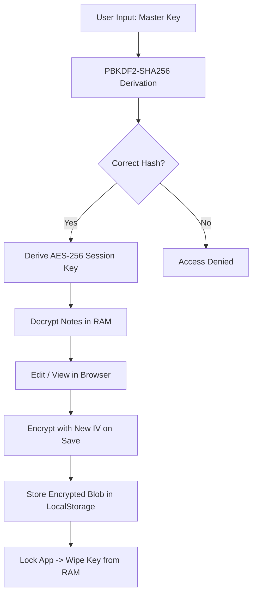

# 🛡️ PrivMITLab-Notes-Pro: The Professional Security Guide (v4.0)

**PrivMITLab-Notes-Pro** is the definitive standalone solution for high-security note-taking. This document provides an in-depth technical overview of the application's architecture, security protocols, and professional features.

---

## 🎯 Strategic Value Proposition

In an era of centralized surveillance and cloud-based data harvesting, **PrivMITLab-Notes-Pro** offers an uncompromising **Zero-Knowledge Architecture**.

1.  **Absolute Privacy:** Your data never leaves your infrastructure. With zero network dependencies, your information remains entirely offline and isolated.
2.  **Military-Grade Cryptography:** Every byte is secured with **AES-256-CBC**. Key derivation uses **PBKDF2-SHA256** with 100,000 iterations to resist brute-force attacks.
3.  **High-Performance Lifecycle:** As a compiled single-file static application, it delivers sub-millisecond responsiveness and complete operability in air-gapped environments.
4.  **Zero-Asset Ownership:** No accounts, no subscriptions, and zero tracking. You retain 100% ownership of the software and your encrypted data.

---

## 🔒 Security Architecture & Flow

The following diagram illustrates the zero-knowledge lifecycle from authentication to persistence:

---

## 🕒 Primary Use Cases

**PrivMITLab-Notes-Pro** is engineered for critical information management:

*   **🔑 Sensitive Credentials:** Securely store recovery phrases, secret keys, and mission-critical access details.
*   **📑 Strategic Planning:** Drafting proprietary business models, competitive intelligence, or privileged legal documents.
*   **🎙️ Professional Dictation:** Utilize high-resolution **Speech-to-Text** for accurate, hands-free field notes in **English or Hindi**.
*   **🧘 Error-Free Proofreading:** Use **Text-to-Speech** with real-time **Word Highlighting** to audit drafts and ensure professional-quality output.
*   **💼 Executive Reporting:** Leverage professional templates and **PDF Export** to generate clean, high-impact documents for stakeholder distribution.

---

## ✨ Feature Deep-Dive

### 🛡️ Core Security Infrastructure
- **RAM-Only Master Key:** Sensitive data never touches the persistent disk; keys are purged immediately upon locking or session end.
- **Atomic Save Operations:** Every save generates a new Initialization Vector (IV), ensuring cryptographic non-repudiation.
- **Emergency Protocols:** Integrated **NUKE** system for immediate local data sanitization in high-risk scenarios.
- **Self-Destruct Mechanism:** Burn-after-reading capability for transient, highly sensitive instructions.

### 🎙️ Advanced Voice Hub
- **Multilingual Recognition:** Professional STT support for English (US) and Hindi (IN).
- **Pro Voice Synthesis:** High-resolution voice model selection with real-time word boundary detection.
- **Sync-Scroll Navigation:** Intelligent editor scrolling synchronized with voice playback for efficient auditing.

### 🎨 Professional Interface
- **Modern Design System:** Choose from **Glassmorphism**, **OLED Dark**, or **Cyberpunk** themes.
- **Optimized Typography:** High-legibility Sans-serif or professional Monospace (JetBrains Mono).
- **Executive Templates:** Pre-configured layouts for **Project Charters**, **Weekly Syncs**, and **Strategy Sessions**.

---

## 🚀 Future Roadmap

1.  **Direct-to-Vault Attachments:** Encrypted image and asset support.
2.  **Biometric Authentication:** Hardware-level security integration (via Desktop wrappers).
3.  **P2P Encrypted Sync:** Fully decentralized, end-to-end encrypted synchronization across trusted local devices.

---

**Developed by [PrivMITLab](https://github.com/PrivMITLab) (@PrivMITLab)**  
*Privacy is Power.*

