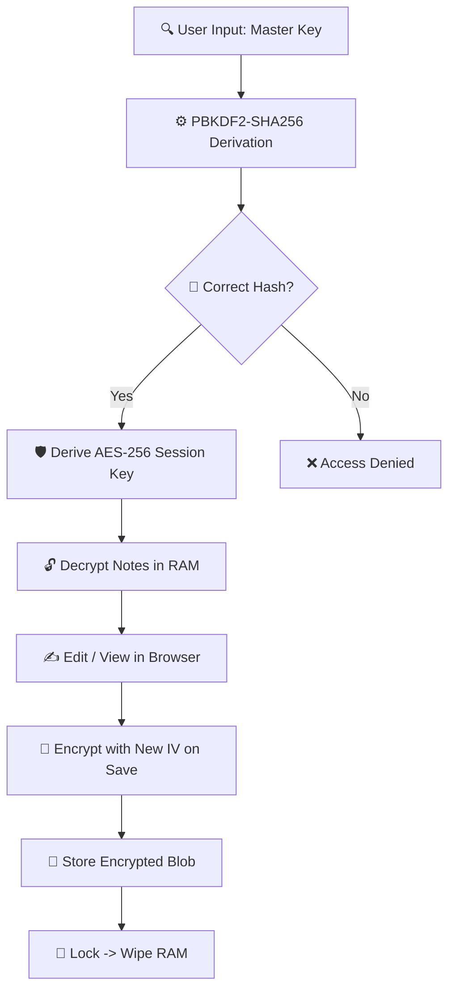

# 🛡️ PrivMITLab-Notes-Pro: The Professional Security Guide (v4.0)

**PrivMITLab-Notes-Pro** is the definitive standalone solution for high-security note-taking. This document provides an in-depth technical overview of the application's architecture, security protocols, and professional features.

---

## 🎯 Strategic Value Proposition

In an era of centralized surveillance and cloud-based data harvesting, **PrivMITLab-Notes-Pro** offers an uncompromising **Zero-Knowledge Architecture**.

1.  **🚀 Absolute Privacy:** Your data never leaves your infrastructure. With zero network dependencies, your information remains entirely offline and isolated.
2.  **🔒 Military-Grade Cryptography:** Every byte is secured with **AES-256-CBC**. Key derivation uses **PBKDF2-SHA256** with 100,000 iterations to resist brute-force attacks.
3.  **⚡ High-Performance Lifecycle:** As a compiled single-file static application, it delivers sub-millisecond responsiveness and complete operability in air-gapped environments.
4.  **💎 Zero-Asset Ownership:** No accounts, no subscriptions, and zero tracking. You retain 100% ownership of the software and your encrypted data.

---

## 🔒 Security Architecture & Flow

The following diagram illustrates the zero-knowledge lifecycle from authentication to persistence:

---

## 🕒 Primary Use Cases

| Category | Description | Benefit |
| :--- | :--- | :--- |
| **🔑 Credentials** | Securely store recovery phrases and secret keys. | 100% Offline isolation. |
| **📑 Strategic**| Confidential project planning and legal drafts. | Zero SaaS exposure. |
| **🎙️ Field Notes** | Accurate **Hindi/English** dictation on the go. | Hands-free efficiency. |
| **💼 Executive** | PDF generation from professional templates. | Clean, audited output. |

---

## ✨ Feature Deep-Dive

<b>🛡️ Core Security Infrastructure</b>

 

- **🧹 RAM-Only Master Key:** Sensitive data never touches the persistent disk; keys are purged immediately upon locking or session end.
- **⚛️ Atomic Save Operations:** Every save generates a new Initialization Vector (IV), ensuring cryptographic non-repudiation.
- **☢️ Emergency Protocols:** Integrated **NUKE** system for immediate local data sanitization in high-risk scenarios.
- **🔥 Self-Destruct Mechanism:** Burn-after-reading capability for transient, highly sensitive instructions.

<b>🎙️ Advanced Voice Hub</b>

 

- **🗣️ Multilingual Recognition:** Professional STT support for English (US) and Hindi (IN).
- **🎼 Pro Voice Synthesis:** High-resolution voice model selection with real-time word boundary detection.
- **📜 Sync-Scroll Navigation:** Intelligent editor scrolling synchronized with voice playback for efficient auditing.

<b>🎨 Professional Interface</b>

 

- **🌈 Modern Design System:** Choose from **Glassmorphism**, **OLED Dark**, or **Cyberpunk** themes.
- **🖋️ Optimized Typography:** High-legibility Sans-serif or professional Monospace (JetBrains Mono).
- **📅 Executive Templates:** Pre-configured layouts for **Project Charters**, **Weekly Syncs**, and **Strategy Sessions**.

---

## 🚀 Future Roadmap

1.  **🖼️ Encrypted Attachments:** Securely store images within the vault.
2.  **💻 Biometric Wrapper:** Hardware-level security integration (via Desktop wrappers).
3.  **📡 P2P Encrypted Sync:** Fully decentralized encrypted synchronization.

---

**Developed by [PrivMITLab](https://github.com/PrivMITLab) (@PrivMITLab)**  
*Privacy is Power.*

